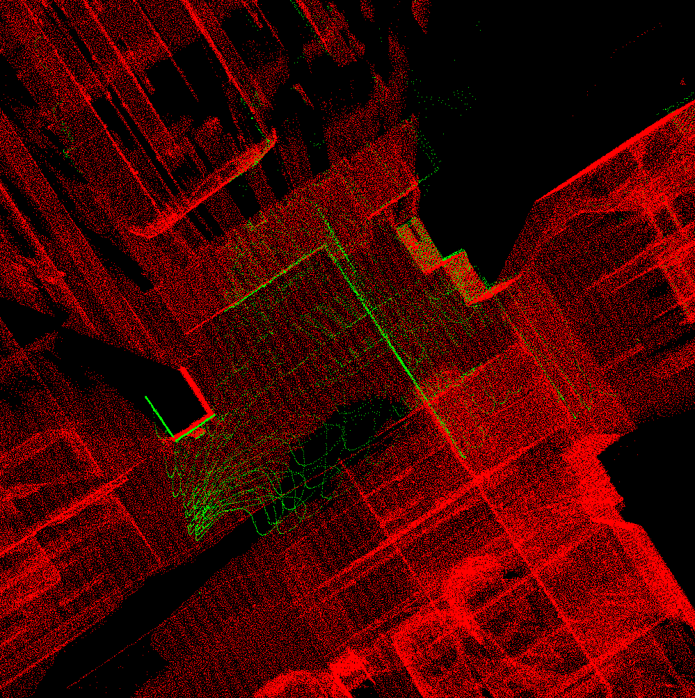

# Livox Automatic Calibration Tools v0.1　Quick Start Guide

[中文文档](./doc/readme-CN.md)
## Introduction
In order to solve the calibration problem, Livox provides an automatic calibration tool. This technology mainly relies on the isomorphic constraint assumption model of the environment to realize automatic calibration, and only needs to use the original point cloud data of the base LiDAR and target LiDAR. Our tool first mapping the environment by using the Base LiDAR data. Then we use the target LiDAR data to continuously iteratively register to the reconstructed map, relying on the constant assumption of the rigidity of geometric structure to continuously reduce the matching error until the algorithm converges And meets the rigidity invariant characteristic of the calibration matrix (six parallel lines). Finally, a consensus algorithm is used to calculate the final calibration matrix.

  
    **Fig.1** Red: Base LiDAR mapping result, Green: Target LiDAR automatic calibration 

## Prerequisites
Cmake, PCL1.7, Eigen

We recommended to install ROS directly, which including the above libraries

```
sudo apt-get install ros-kinetic-cv-bridge ros-kinetic-tf ros-kinetic-message-filters ros-kinetic-image-transport

```
## Compile

```

mkdir build
cd build
cmake ..
make

```

This operation will generate three files, namely **mapping**, **calibration**, **fitline**　  

* **mapping:** Mapping Tool　　

* **calibration:** Automatic Calibration Tool

* **fitline:** Fit the calibration parameters and calculate the final calibration matrix and Quaternion　　


## Run
### **1. Prepare .pcd pointcloud data for calibration**　　

* Put the base LiDAR data into: data/Base_LiDAR_Frames/.pcd (Use 100000.pcd as the first frame file name, and the subsequent frames are accumulated upward)  

* Put the target LiDAR data into: data/Target_LiDAR_Frames/.pcd (Use 100000.pcd as the first frame file name, and the subsequent frames are accumulated upward)  

* Put the initial matrix data into: data/Init_Matrix.txt  

**Note**: The base LiDAR data and the target LiDAR data need to be synchronized in time as much as possible, and the file name and time stamp correspond to synchronization.

**Download example data set**  
 [**Target-LiDAR-Frames**](https://terra-1-g.djicdn.com/65c028cd298f4669a7f0e40e50ba1131/Showcase/Target-LiDAR-Frames.tar.gz)  
 [**Base_LiDAR_Frames**](https://terra-1-g.djicdn.com/65c028cd298f4669a7f0e40e50ba1131/Showcase/Base_LiDAR_Frames.tar.gz)  


### **2. run**
```
cd livox_calibration
cp run.sh build/
cd build
sh run.sh

```
The script first starts the visualize mapping program **mapping**，Use base LiDAR to build a submap. After that, the script starts **calibration** program to automatic calibration target LiDAR to base LiDAR，estimated the calibration parameters for each frames. Finally, the script launchs the Curve fitter **fitline**，to estimate the final parameter matrix.

 
**Fig.2** Out put result of example data set

## **NOTE：**  
* Must ensure the data synchronization between sensors  
* Must ensure the precision of base LiDAR mapping result  
* The movement of the data collection vehicle or platform must be as slow as possible, and we recommended to correct the motion distortion between each frames  to ensure the final accuracy  
* The accurate initial external parameter matrix is not needed, but it should be roughly aligned to ensure the final accuracy as much as possible  
* For Mid-40, Horizon models, the converted PCD file refers to 100ms as one frame  

## Support
You can get support from Livox with the following methods:

* Send email to cs@livoxtech.com with a clear description of your problem and your setup
* Github Issues

## Citation
This code is based on the research below:
```
@article{gong2018target,
title={A Target-Free Automatic Self-Calibration Approach for Multibeam Laser Scanners},
author={Gong, Zheng and Wen, Chenglu and Wang, Cheng and Li, Jonathan},
journal={IEEE Transactions on Instrumentation and Measurement},
volume={67},
number={1},
pages={238--240},
year={2018},
publisher={IEEE}
   }
   
```

**Developer: [Livox](https://www.livoxtech.com/)**

